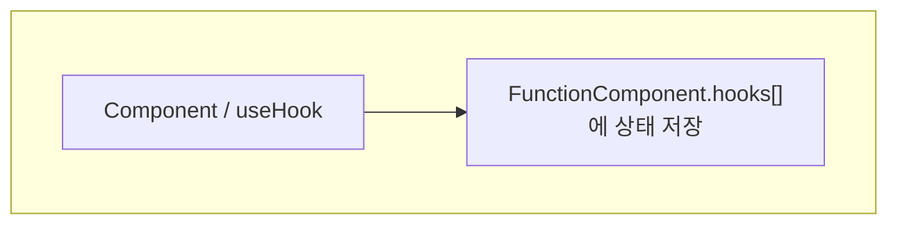
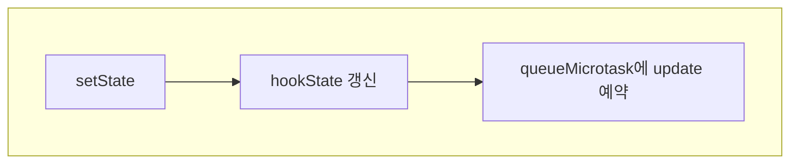
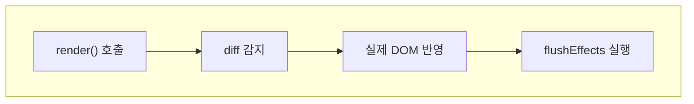
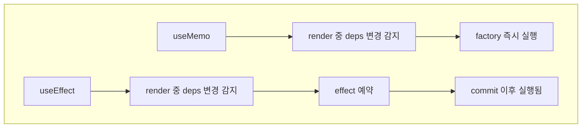
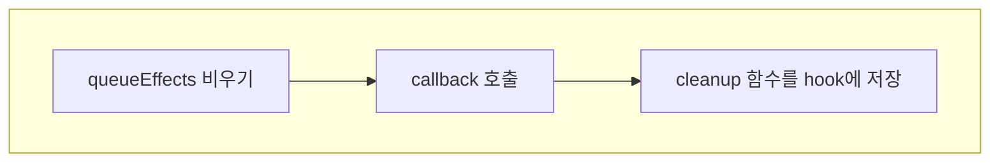

# Stopwatch for Custom REACT

### Demo Screenshots

#### Dark/Light Theme

| **다크 모드**


| **라이트 모드**


#### Snapshot

| **실행 화면**


## Demo Architecture
컴포넌트 포함 관계와 역할은 다음과 같습니다.

### Layout


- `App Mount Layer`
  - `src/app.js`가 최상위 진입점이며 `RootApp`을 실제 DOM에 mount한다.
- `RootApp`
  - 최상위 루트 컴포넌트다.
  - `ThemeToggle`과 `StopwatchCard`를 포함한다.
  - 앱의 모든 상태인 `theme`, `running`, `elapsedMs`, `startedAtMs`, `laps`를 관리한다.
  - 시작, 정지, 초기화, 구간 기록, 테마 변경 같은 이벤트 핸들러를 정의하고 자식에게 props로 전달한다.
- `ThemeToggle`
  - `RootApp`에 포함되는 보조 UI 컴포넌트다.
  - 현재 테마 상태를 표시하고, 버튼 클릭 시 테마 전환 이벤트를 발생시킨다.
- `StopwatchCard`
  - `RootApp`에 포함되는 메인 시계 UI 컴포넌트다.
  - 현재 시간, 실행 상태, 랩 목록, fastest/slowest 표시값을 props로 받아 화면을 렌더링한다.
  - 자체 상태를 갖지 않고, 시작/정지 버튼과 구간 기록/초기화 버튼 클릭을 부모 핸들러에 위임한다.
- `TimeSlots`, `LapsPanel`
  - `StopwatchCard` 내부 화면을 세부적으로 나누는 하위 표시 컴포넌트다.
  - 시간 표시 영역과 랩 목록 표시 영역처럼 UI 책임을 분리하는 역할을 한다.

## React architecture
### Hooks & State manager
`useState`, `useEffect`, `useMemo`가 어떻게 연결되는지 보여 주는 로직 아키텍처입니다.
- `useState`는 hooks 배열에 상태를 저장하고 setter 호출 시 루트 컴포넌트의 재렌더를 예약합니다.
- `useEffect`는 의존성이 바뀔 때만 실행되며, 스톱워치 interval 등록과 cleanup, document title 변경, theme 저장을 담당합니다.
- `useMemo`는 랩 목록이 바뀔 때만 최신 랩, fastest lap, slowest lap 같은 파생값을 다시 계산합니다.
- 훅 실행 순서는 `currentInstance`와 `hookIndex`로 추적되며, 각 렌더에서 같은 순서로 hooks 슬롯을 재사용합니다.
- 이 모든 hook은 `FunctionComponent`싱글톤 객체에 의해 관리된다.

#### Real React
- `useState`는 update queue에 priority와 함께 넣어 리액트가 다음 렌더에서 순서대로 처리한다.
- `useEffect`는 커밋 이후에 실행된다. (render phase, commit phase 분리됨)
- React는 각 컴포넌트 인스턴스마다 별도의 Fiber가 존재하고, 상태도 그 Fiber에 귀속된다.

### Batching

- `setState`시 `instance.scheduleUpdate()` 실행. 코드 한 블럭에서 `setState`가 여러 번 실행되어도 `update`가 한 번만 실행될 수 있게 flag와 `queueMicrotask()`로 관리한다.
  즉, 즉시 `update`가 아닌 예약을 걸어서 (동기 코드가 끝나는)짧은 시간 안에 변경된 모든 state를 `update`한다.

#### Real React
- *microTask는 너무 빠르기에 실제 react는 MessageChannel + setImmediate, fallback으로 setTimeout을 사용한다.*


## 구현된 중점 포인트
- Component 분리
  - 루트 상태와 화면 표현을 분리해 `RootApp`은 상태와 로직, `StopwatchCard`는 props-only UI에 집중하도록 구성했다.
- State는 어디에 두는 것이 좋은지
  - 과제 조건에 맞춰 모든 상태를 루트 컴포넌트에만 두고 자식은 stateless로 유지했다. 이 구조 덕분에 상태 흐름이 단방향으로 고정되고, 어떤 이벤트가 어떤 렌더를 유발하는지 추적하기 쉬워졌다.
- `setState`는 상태 변경 외에 무엇을 하는지
  - setter는 값을 바꾸는 것에서 끝나지 않고 `scheduleUpdate()`를 호출해 다음 microtask에 렌더를 예약한다. 이후 루트 컴포넌트를 다시 실행하고, 새 VDOM과 이전 VDOM을 비교해 patch를 만든다.
- Batching을 어떻게 구현했는지
  - `queueMicrotask` 기반으로 같은 동기 실행 구간에서 발생한 여러 상태 변경을 한 번의 update로 묶는다. 예를 들어 초기화처럼 여러 state를 연속으로 바꿔도 렌더는 한 번만 수행된다.
- 이 프로젝트와 실제 React는 어떻게 다른지
  - 실제 React처럼 Fiber 단위 스케줄링이나 concurrent rendering을 제공하지 않는다.
  - 상태가 일부만 바뀌어도 현재 구조에서는 `RootApp` 전체가 다시 실행된다.
  - diff는 실용적인 heuristic 비교이며, 항상 최적 편집 비용을 보장하지 않는다.
  - 교육용 구현이므로 React의 생태계 기능보다 hooks와 VDOM 흐름을 직접 확인하는 데 초점을 맞췄다.

#### mount render 시 hooks에 상태 저장



#### Batching


#### update()


#### render() from microtask


#### flushEffects


## 단위테스트
총 6개 테스트가 모두 통과했다.

- `app.test.js`
  - 시작 → 시간 경과 → 구간 기록 → 정지 → 초기화까지 실제 앱 플로우가 정상 동작하는지 검증
- `function-component.test.js`
  - `useState`가 state를 유지하고 여러 업데이트를 하나의 microtask로 batching하는지 검증
  - `useEffect` cleanup과 `useMemo` 캐싱이 의존성 변경에 맞게 동작하는지 검증
- `vdom.test.js`
  - 변경된 text와 attribute만 patch되는지 검증
  - child node 추가/삭제가 정상 반영되는지 검증
  - keyed reorder 시 기존 DOM 노드를 재사용하면서 순서와 속성이 올바르게 갱신되는지 검증

실행 결과:

```bash
✔ app flow reacts to clicks and timer effect
✔ useState persists state and batches updates in one microtask
✔ useEffect cleanup runs when dependencies change and useMemo caches values
✔ diff + patch updates only changed text and attributes
✔ diff + patch creates and removes child nodes
✔ diff keeps vnode inputs immutable and applies keyed reorders to the matched DOM nodes

tests 6
pass 6
fail 0
```

## 엣지케이스
- 스톱워치가 멈춘 상태에서 `초기화`를 누르면 시간과 랩 목록이 모두 초기 상태로 돌아가야 한다.
- 아직 시간이 흐르지 않았거나 실행 중이 아닐 때 보조 버튼은 `초기화`로 동작해야 한다.
- 실행 중 `구간 기록`을 빠르게 여러 번 눌러도 랩 번호와 누적 시간 계산이 꼬이지 않아야 한다.
- interval effect는 `running`이 false가 되거나 시작 시간이 바뀌면 이전 timer를 반드시 cleanup해야 한다.
- theme 값은 새로고침 이후에도 `localStorage`를 통해 복원되어야 하며, 저장된 값이 없으면 시스템 선호 테마를 안전하게 fallback해야 한다.
- keyed list diff 과정에서 기존 VNode 입력값이 변형되지 않아야 이후 비교가 안정적으로 유지된다.
- 여러 `setState`가 같은 tick 안에서 연속 호출돼도 불필요한 중복 렌더가 발생하지 않아야 한다.

- useEffect 무한 루프
아래 코드의 경우, count변경 감지시, effect 콜백 함수 호출 -> setCount -> count 변경 ... 무한루프를 돌 수 있다.
```js
useEffect(() => { // 무한루프
    setCount(prev => prev + 1);
    return () => {
      console.log('cleanup!')
    }
  }, [count])
```

## 회고
- 홍윤기: 지금까지 수요 코딩회를 진행하면서 깨달은 것은 AI Agent를 통해 원하는 기능을 만들려면 결국 코드를 읽어야하고 흐름을 읽고 분석할 줄 알아야하는 것이다.
- 전우현: 수요 코딩회를 통해 가장 크게 얻은 건, 단순히 React를 “쓰는 입장”에서 벗어나 “왜 이렇게 만들어졌는지 고민하는 입장”으로 바뀌었다는 점이다. 이전에는 state가 바뀌면 자동으로 렌더링된다는 정도로만 이해하고 있었는데, 이제는 그 뒤에서 어떤 흐름이 돌아가는지, 어떤 비용을 줄이기 위해 이런 구조를 선택했는지까지 생각하게 됐다.
- 최현진: 바이브 코딩을 계속하다 보니 어떻게 하면 결과 품질을 더 높일 수 있는지 감이 잡힌 것 같다. 비판적 사고를 유도하고, 대화 내용을 메모장에 정리하면서 매 실행마다 확인하도록 하니 토큰이 꽉 차 압축되더라도 어느 정도 품질이 유지되는 것을 느꼈다
