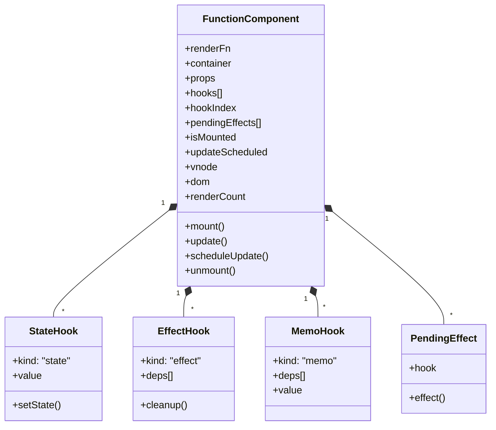
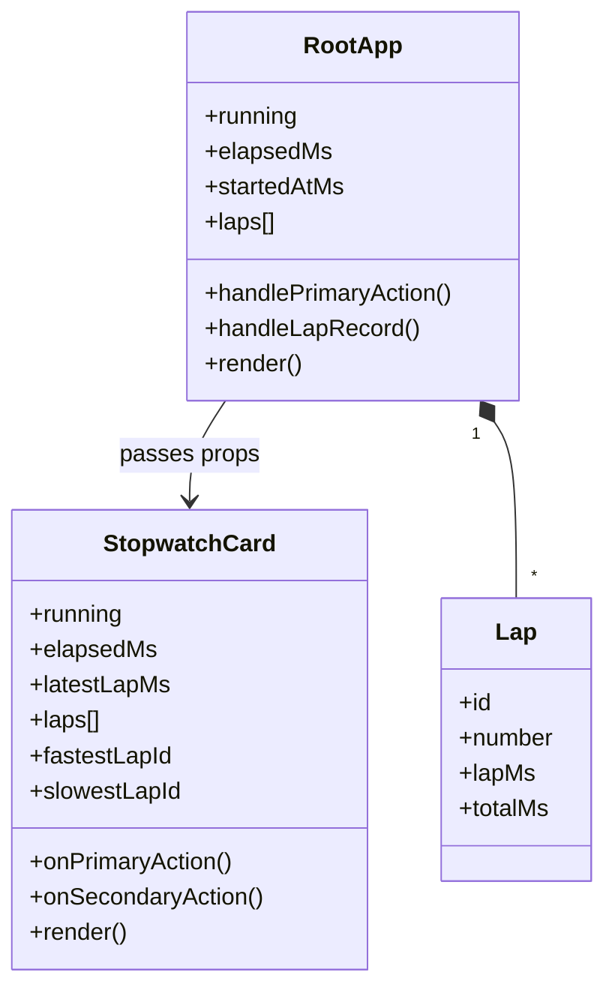
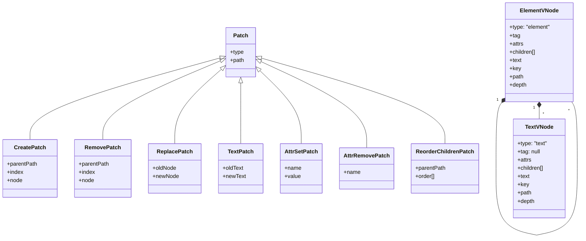
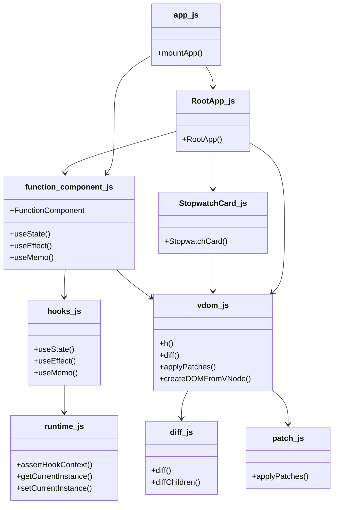

# 클래스 다이어그램 문서

이 문서는 현재 프로젝트의 핵심 타입과 모듈 관계를 클래스 다이어그램 형태로 정리한 문서입니다.

엄밀히 말하면 이 프로젝트는 함수와 모듈 중심 구조이고 클래스는 `FunctionComponent` 하나가 핵심입니다.  
그래서 아래 다이어그램은 `실제 class`와 `구조체처럼 쓰이는 객체 타입`을 함께 보여 주는 방식으로 보는 것이 맞습니다.

## 1. 런타임 클래스 다이어그램

## 2. 앱 계층 다이어그램

## 3. Virtual DOM 타입 다이어그램

## 4. 모듈 관계 다이어그램

## 5. 해설

- `FunctionComponent`는 이 프로젝트의 핵심 런타임 클래스입니다.
- `StateHook`, `EffectHook`, `MemoHook`은 클래스라기보다 저장 구조체에 가깝습니다.
- `RootApp`은 루트 상태와 로직을 가진 함수형 컴포넌트입니다.
- `StopwatchCard`는 props-only 자식 컴포넌트입니다.
- `ElementVNode`, `TextVNode`, `Patch` 계열은 VDOM과 diff 결과를 표현하는 데이터 구조입니다.

## 6. 발표용 한 줄 설명

> 클래스 다이어그램 관점에서 보면, `FunctionComponent`가 런타임 중심 클래스이고, 그 안에 hook 상태와 pending effect가 매달리며, 앱 계층에서는 `RootApp`이 상태를 소유하고 `StopwatchCard`는 props-only 자식으로 연결되는 구조입니다.
