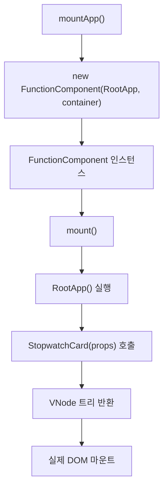
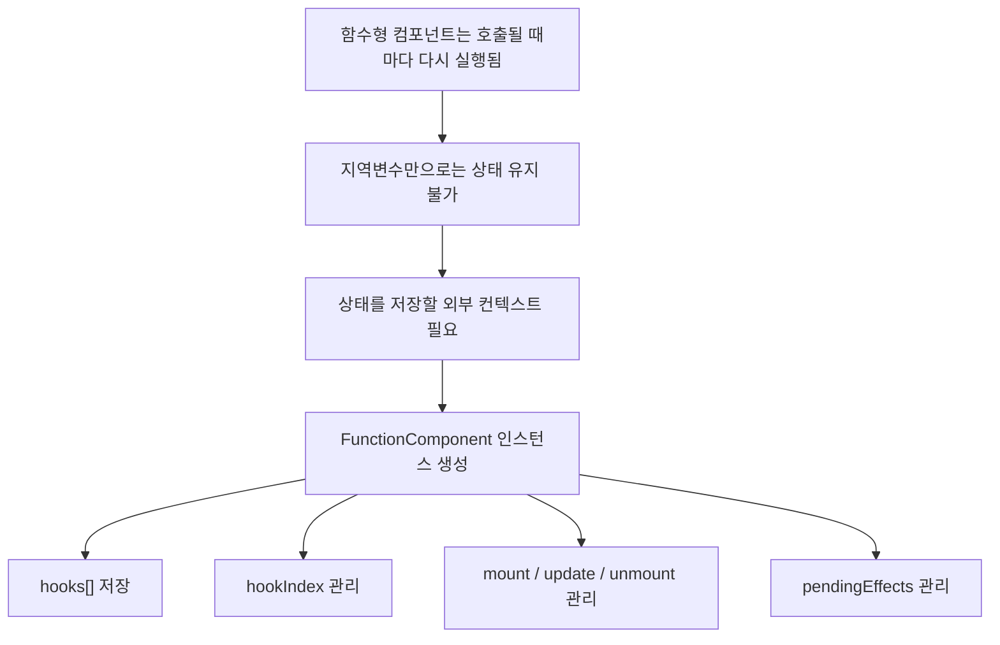
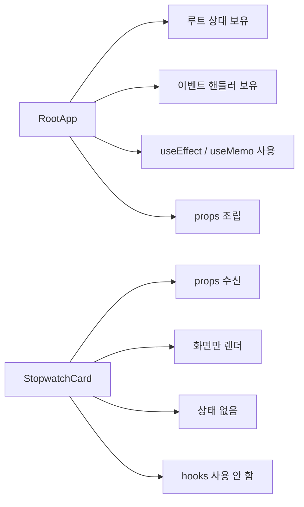
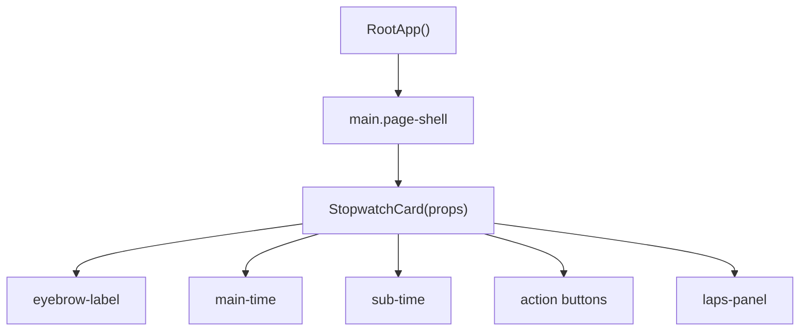
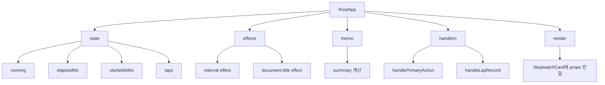
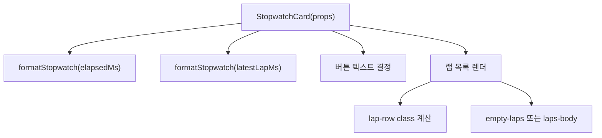
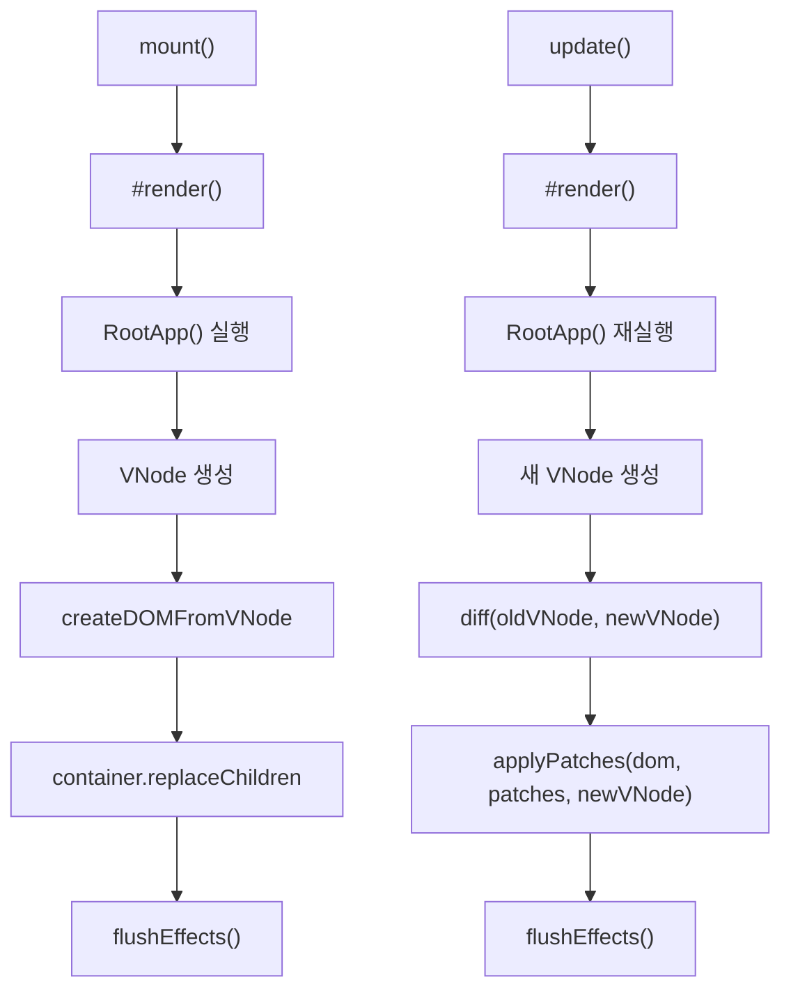
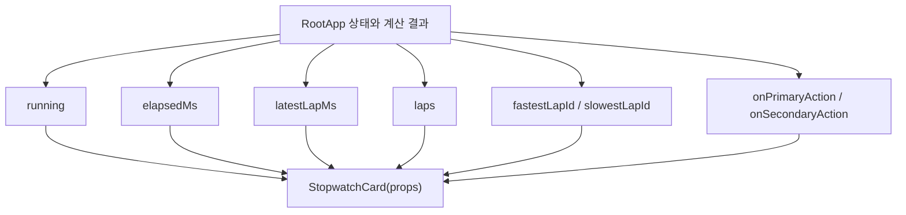
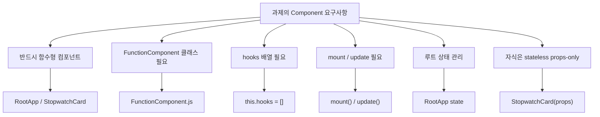

# 컴포넌트 구현 시각화 문서

이 문서는 과제의 `Component` 요구사항에 맞춰  
현재 프로젝트에서 **컴포넌트를 어떤 구조로 구현했는지**를 시각적으로 설명하는 문서입니다.

핵심은 이 세 가지입니다.

1. `FunctionComponent` 클래스로 함수형 컴포넌트를 감싼다.
2. 상태는 루트 컴포넌트 `RootApp`에만 둔다.
3. 자식 컴포넌트 `StopwatchCard`는 props만 받는 stateless 컴포넌트로 둔다.

## 1. 전체 컴포넌트 구조

## 2. 왜 FunctionComponent 클래스를 두었나

### 해설

- 함수형 컴포넌트는 그냥 함수이기 때문에, 호출만으로는 이전 상태를 기억할 수 없습니다.
- 그래서 이 프로젝트에서는 `FunctionComponent`가 런타임 인스턴스 역할을 맡습니다.
- 이 인스턴스 안에 `hooks[]`, `pendingEffects[]`, `vnode`, `dom`이 들어 있습니다.

## 3. 루트와 자식의 역할 분리

## 4. 현재 프로젝트의 컴포넌트 계층

### 해설

- `RootApp`은 상태와 동작을 소유하는 루트 컴포넌트입니다.
- `StopwatchCard`는 시계 화면을 그리는 순수 함수형 자식 컴포넌트입니다.
- 과제의 `Lifting State Up` 요구사항을 그대로 따른 구조입니다.

## 5. RootApp 내부 구성

## 6. StopwatchCard 내부 구성

### 해설

- `StopwatchCard`는 상태를 갖지 않습니다.
- 부모가 넘긴 `running`, `elapsedMs`, `laps`, `fastestLapId`, `slowestLapId`를 이용해 화면만 그립니다.
- 즉, 완전한 props-only 컴포넌트입니다.

## 7. mount와 update 흐름

## 8. props 전달 흐름

### 해설

- 자식은 모든 데이터를 props로 받습니다.
- 자식 내부에서 상태를 따로 만들지 않습니다.
- 이 구조 덕분에 데이터 흐름이 한 방향입니다.

## 9. 과제 요구사항과 연결하면

## 10. 발표용 한 줄 설명

> 이 프로젝트의 컴포넌트 구조는 `FunctionComponent`가 함수형 컴포넌트의 실행 컨텍스트를 맡고, 루트 `RootApp`이 상태와 로직을 모두 관리하며, 자식 `StopwatchCard`는 props만 받아 화면을 그리는 stateless 구조입니다.
