# 자료구조 · 알고리즘 관점 다이어그램

현재 저장소의 최신 스톱워치 시연 버전을 기준으로,  
이 문서는 "무슨 파일이 있나"보다 "`어떤 자료구조를 쓰고`, `어떤 알고리즘으로 동작하나`"에 집중해 정리한 학습용 시각화 자료입니다.

## 1. 핵심 자료구조 지도

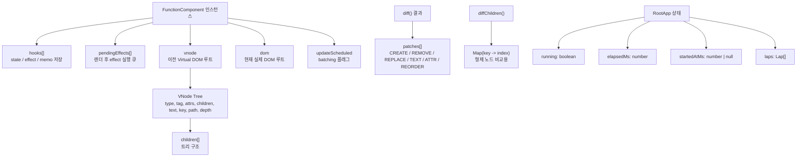

### 해설

- `FunctionComponent`는 현재 엔진의 실행 컨텍스트입니다.
- `hooks[]`는 훅 호출 순서대로 상태를 저장하는 배열입니다.
- `pendingEffects[]`는 렌더가 끝난 뒤 실행할 effect를 임시로 담아두는 큐입니다.
- `vnode`는 이전 렌더의 Virtual DOM 루트이고, `dom`은 현재 실제 DOM 루트입니다.
- `patches[]`는 diff 결과인 변경 명령 목록입니다.
- `Map(key -> index)`는 형제 배열 비교를 빠르게 하기 위한 보조 자료구조입니다.
- 루트 상태는 `running`, `elapsedMs`, `startedAtMs`, `laps` 네 가지로 단순화되어 있습니다.

## 2. 루트 상태 자료구조

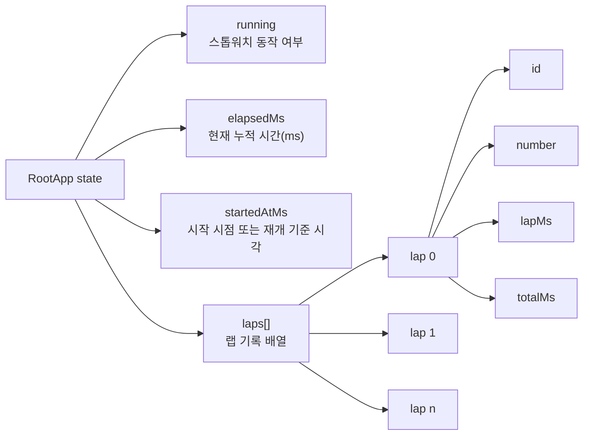

### 해설

- `running`은 interval effect를 켤지 말지를 결정합니다.
- `elapsedMs`는 메인 시간 텍스트의 원본 숫자 데이터입니다.
- `startedAtMs`는 재시작 시에도 누적 시간을 유지하기 위한 기준 시각입니다.
- `laps[]`는 최신 랩이 맨 앞에 오도록 관리됩니다.
- 각 랩 객체는 `id`, `number`, `lapMs`, `totalMs`를 갖습니다.

## 3. VNode 트리 구조

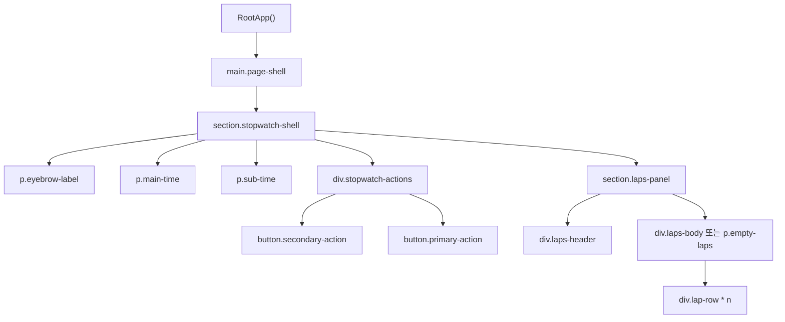

### 해설

- 화면은 계층 구조이기 때문에 트리 자료구조로 표현하는 것이 가장 자연스럽습니다.
- `h()`는 결국 이 트리의 각 노드를 메모리 상 객체로 만듭니다.
- diff는 old/new 두 트리를 재귀적으로 비교합니다.
- 랩 목록은 `laps.length`에 따라 `empty state` 또는 `lap-row` 서브트리로 갈라집니다.

## 4. Hooks 배열 인덱스 매핑

```mermaid
flowchart LR
    A["RootApp 렌더 시작"] --> B["hookIndex = 0"]
    B --> C["useState(running)"]
    C --> C1["hooks[0] = state"]
    C1 --> D["useState(elapsedMs)"]
    D --> D1["hooks[1] = state"]
    D1 --> E["useState(startedAtMs)"]
    E --> E1["hooks[2] = state"]
    E1 --> F["useState(laps)"]
    F --> F1["hooks[3] = state"]
    F1 --> G["useEffect(interval)"]
    G --> G1["hooks[4] = effect"]
    G1 --> H["useMemo(summary)"]
    H --> H1["hooks[5] = memo"]
    H1 --> I["useEffect(title)"]
    I --> I1["hooks[6] = effect"]
```

### 해설

- 이 엔진은 훅 이름이 아니라 "호출 순서"로 훅을 식별합니다.
- 첫 번째 훅은 `hooks[0]`, 두 번째 훅은 `hooks[1]`처럼 저장됩니다.
- 다음 렌더에서도 같은 순서로 호출되면 같은 슬롯을 다시 읽습니다.
- 그래서 훅은 조건문 안에서 호출하면 안 됩니다. 순서가 바뀌면 상태 슬롯 매핑이 깨집니다.

### 왜 배열인가

- 인덱스 접근이 빠릅니다: `O(1)`
- 호출 순서를 그대로 저장할 수 있습니다.
- 구현이 단순해서 교육용 엔진에 적합합니다.

## 5. 상태 변경 알고리즘

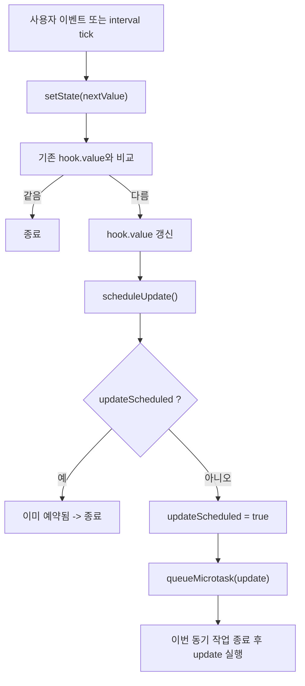

### 해설

- `setState`는 단순 대입 함수가 아닙니다.
- 값을 바꾸고, 렌더가 필요하면 `scheduleUpdate()`를 호출합니다.
- `updateScheduled`는 같은 이벤트 안에서 여러 번 렌더가 예약되는 것을 막습니다.
- 실제 렌더는 microtask로 미뤄집니다. 이것이 batching입니다.

## 6. 스톱워치 액션 알고리즘

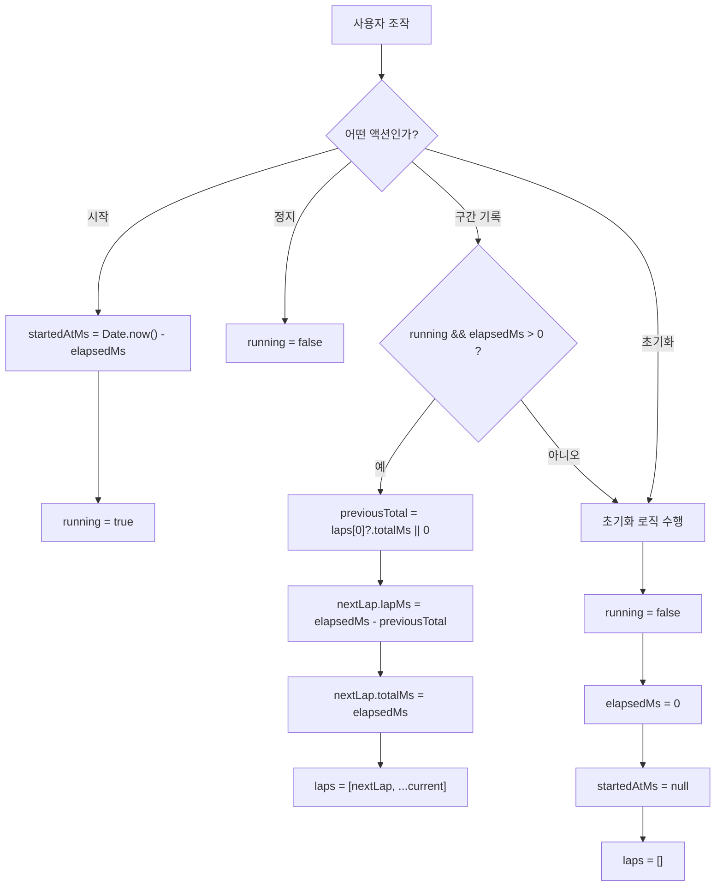

### 해설

- `시작`은 현재 누적 시간을 유지한 채 이어 달리기 위해 `Date.now() - elapsedMs`를 저장합니다.
- `정지`는 interval effect가 꺼지도록 `running`만 `false`로 바꿉니다.
- `구간 기록`은 이전 총 시간과 현재 총 시간의 차이를 이용해 `lapMs`를 구합니다.
- `초기화`는 네 개의 루트 상태를 모두 초기값으로 되돌립니다.

## 7. useMemo 요약 계산 알고리즘

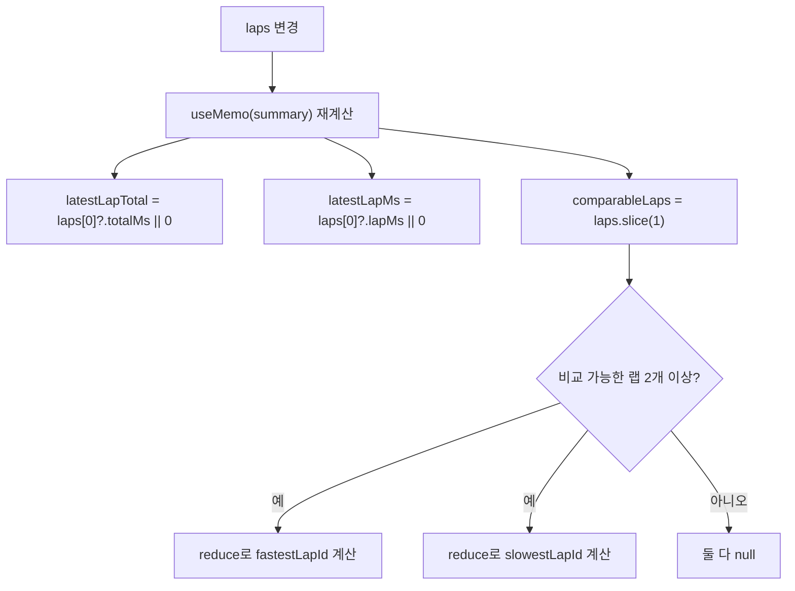

### 해설

- 가장 최근 랩은 따로 강조되므로, 빠른 랩/느린 랩 비교에서는 `laps.slice(1)`로 제외합니다.
- `reduce`를 써서 최솟값, 최댓값 랩을 각각 찾습니다.
- 이 계산은 `laps`가 바뀔 때만 다시 수행됩니다.

## 8. Diff 알고리즘

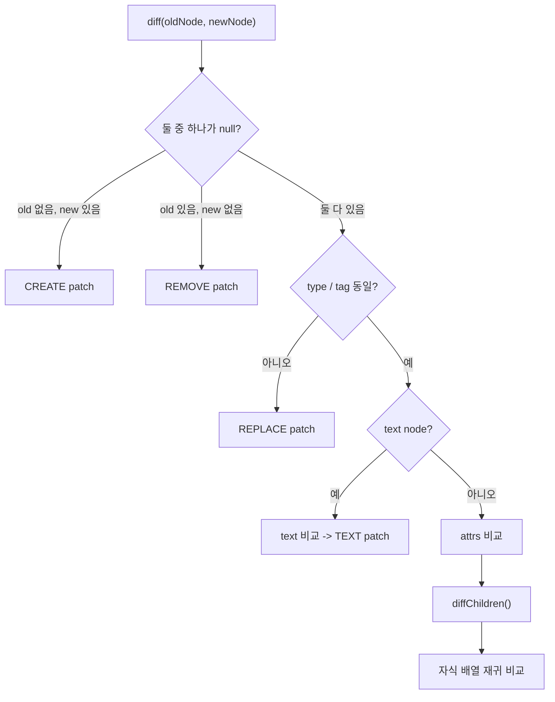

### 해설

- `diff`는 old/new VDOM을 비교해 patch 목록을 만듭니다.
- 비교 순서는 다음과 같습니다.
  1. 노드가 생겼으면 `CREATE`
  2. 노드가 사라졌으면 `REMOVE`
  3. 타입이나 태그가 다르면 `REPLACE`
  4. 텍스트면 `TEXT`
  5. 엘리먼트면 속성 비교 후 자식 배열 비교

## 9. 형제 노드 비교 알고리즘

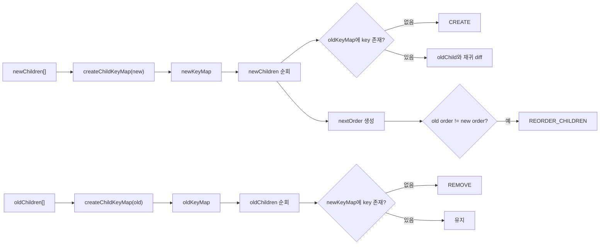

### 해설

- 랩 목록처럼 자식이 여러 개인 구간은 형제 비교가 중요합니다.
- `Map`을 쓰면 `key -> old index`를 빠르게 찾을 수 있습니다.
- 새 배열 기준으로는 생성/유지 여부를 판단하고, 이전 배열 기준으로는 삭제 여부를 판단합니다.
- 마지막에 순서가 달라졌으면 `REORDER_CHILDREN` patch를 만듭니다.

## 10. Patch 적용 알고리즘

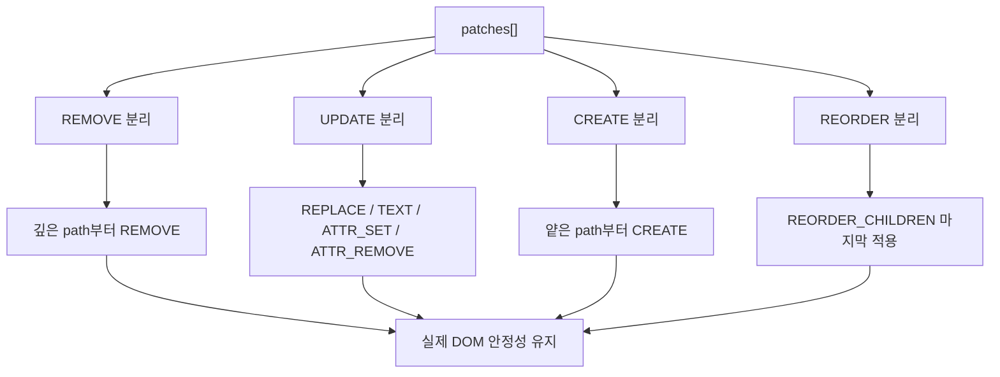

### 해설

- patch는 순서 없이 적용하면 DOM 참조가 꼬일 수 있습니다.
- 그래서 `REMOVE`, `UPDATE`, `CREATE`, `REORDER`를 분리하고 순서를 제어합니다.
- 특히 `REMOVE`는 깊은 노드부터, `REORDER`는 가장 마지막에 적용하는 점이 중요합니다.

## 11. 복잡도 관점 요약

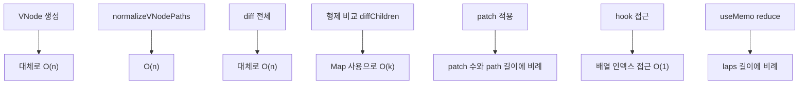

### 해설

- `n`을 전체 VNode 수라고 보면, VNode 생성과 전체 diff는 대체로 `O(n)`입니다.
- `k`를 특정 부모의 자식 수라고 보면, 형제 비교는 `Map` 덕분에 `O(k)`에 가깝습니다.
- patch 적용은 patch 개수와 path 길이에 영향을 받습니다.
- hook 접근은 배열 인덱스 접근이므로 `O(1)`입니다.
- 랩 통계 계산은 `laps` 길이에 비례합니다.

## 12. 메모리와 정리(cleanup) 관점

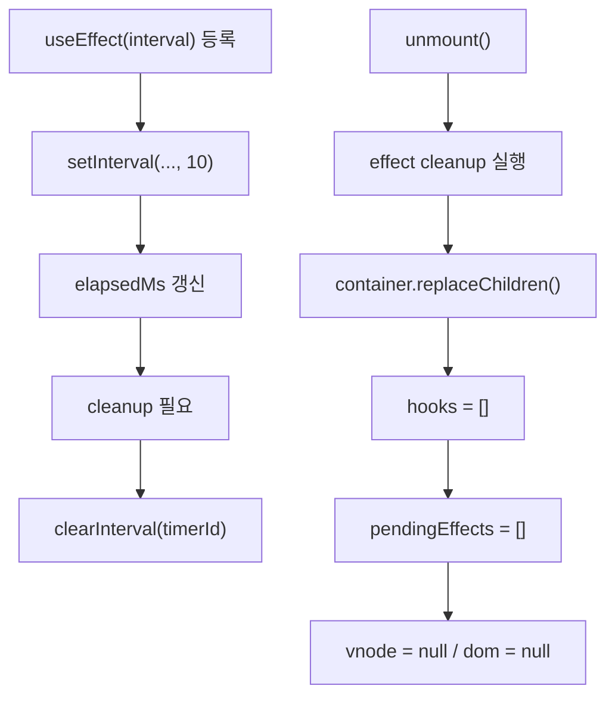

### 해설

- 이 엔진이 가비지 컬렉터를 직접 만드는 것은 아닙니다.
- 대신 cleanup과 참조 해제를 통해 자바스크립트 런타임 GC가 회수할 수 있게 만듭니다.
- interval effect의 cleanup이 없으면 중복 타이머나 메모리 누수가 생길 수 있습니다.

## 13. 이 구조의 장점과 한계

### 장점

- 트리, 배열, 맵만으로 React 핵심 원리를 설명할 수 있습니다.
- 구현이 단순해서 발표와 학습에 적합합니다.
- `queueMicrotask` batching, `useEffect` cleanup, key 기반 자식 비교까지 포함되어 있어 교육용으로 밀도가 높습니다.

### 한계

- 루트 중심 구조라 상태 하나만 바뀌어도 `RootApp()` 전체가 다시 실행됩니다.
- `diff()`는 완전한 최적 patch를 찾는 것이 아니라 실용적인 heuristic 비교입니다.
- 실제 React처럼 Fiber 기반 서브트리 스케줄링이나 `React.memo` 수준 최적화는 없습니다.

## 14. 한 줄 요약

> 이 프로젝트는 트리(VNode), 배열(hooks / pendingEffects / patches), 맵(key-index map)이라는 기본 자료구조 위에서, 재귀 diff와 path 기반 patch 알고리즘으로 스톱워치 앱의 상태 변화와 화면 갱신을 연결한 커스텀 React 코어 구현입니다.
