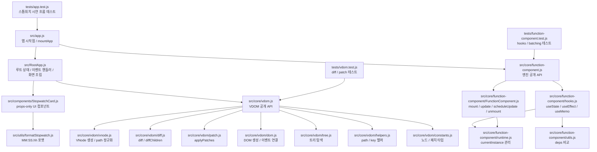
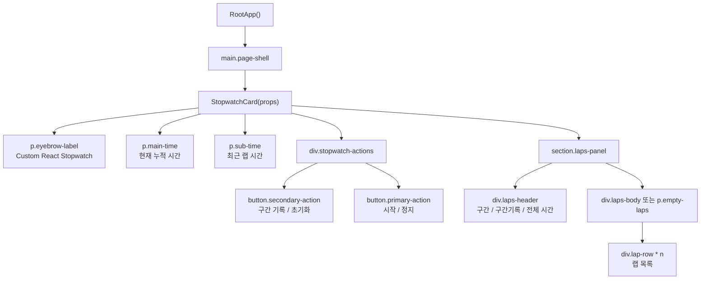
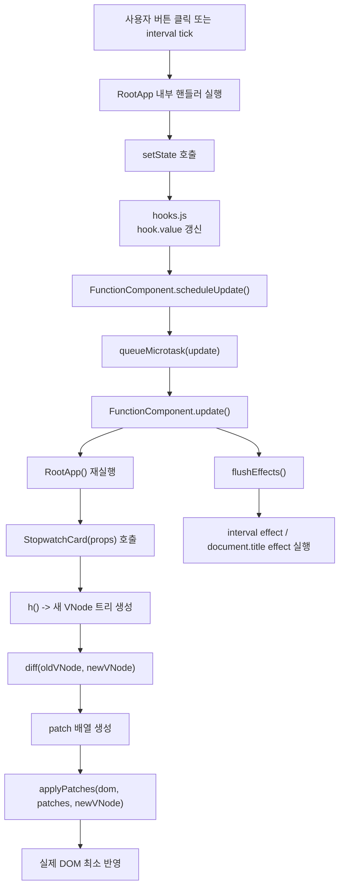
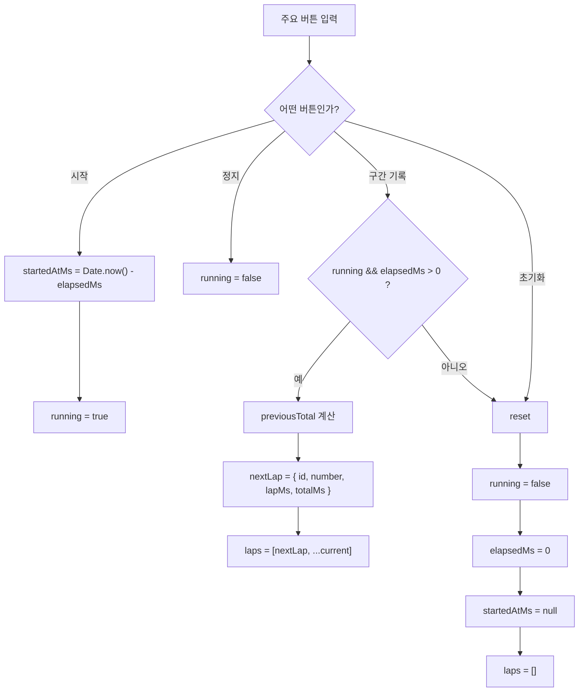
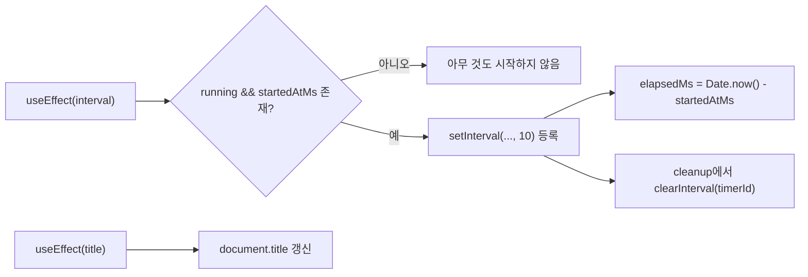
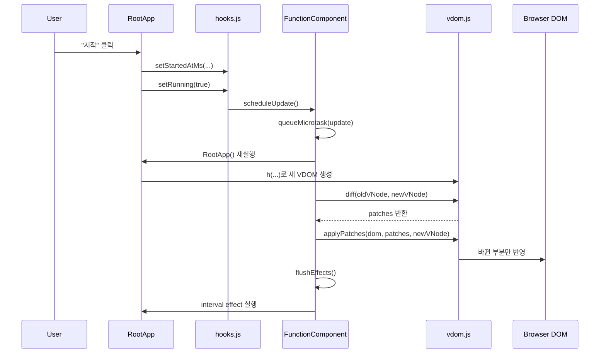

# 시스템 구성도와 흐름도

현재 저장소의 최신 스톱워치 시연 버전을 기준으로 정리한 문서입니다.  
이 문서는 `파일이 어떻게 나뉘어 있는지`, `실행 흐름이 어떻게 이어지는지`, `시연 중 어떤 버튼이 어떤 상태 변화를 만드는지`를 한 번에 이해하는 데 목적이 있습니다.

## 1. 시스템 파일 구성도



## 2. 폴더 계층도

```text
src/
├─ app.js
├─ RootApp.js
├─ styles.css
├─ components/
│  └─ StopwatchCard.js
├─ utils/
│  └─ formatStopwatch.js
└─ core/
   ├─ function-component.js
   ├─ vdom.js
   ├─ function-component/
   │  ├─ FunctionComponent.js
   │  ├─ hooks.js
   │  ├─ runtime.js
   │  └─ utils.js
   └─ vdom/
      ├─ constants.js
      ├─ vnode.js
      ├─ dom.js
      ├─ diff.js
      ├─ patch.js
      ├─ tree.js
      └─ helpers.js
```

## 3. 화면 컴포넌트 구조



## 4. 런타임 전체 흐름



## 5. 사용자 액션별 흐름



## 6. effect 중심 흐름



## 7. Hooks 내부 흐름

```mermaid
flowchart LR
    A["렌더 시작"] --> B["hookIndex = 0"]
    B --> C["useState(running)"]
    C --> D["useState(elapsedMs)"]
    D --> E["useState(startedAtMs)"]
    E --> F["useState(laps)"]
    F --> G["useEffect(interval)"]
    G --> H["useMemo(summary)"]
    H --> I["useEffect(title)"]
    I --> J["렌더 종료"]
```



## 8. 실제 호출 순서



## 9. 역할 분리 요약

### 앱 계층

- `app.js`: `FunctionComponent`를 생성하고 앱을 mount합니다.
- `RootApp.js`: 상태와 핸들러를 소유하는 루트 컴포넌트입니다.
- `StopwatchCard.js`: props만 받아 화면을 그리는 stateless 자식 컴포넌트입니다.
- `formatStopwatch.js`: 시연 화면에 필요한 시간 문자열 포맷을 담당합니다.

### 함수형 컴포넌트 엔진

- `FunctionComponent.js`: 렌더링 사이클, `mount`, `update`, `scheduleUpdate`, `unmount`를 담당합니다.
- `hooks.js`: `useState`, `useEffect`, `useMemo`를 구현합니다.
- `runtime.js`: 현재 렌더 중인 인스턴스를 보관합니다.
- `utils.js`: 의존성 배열 비교를 담당합니다.

### Virtual DOM 엔진

- `vnode.js`: VNode를 만들고 경로를 정규화합니다.
- `diff.js`: 이전/현재 VDOM을 재귀적으로 비교합니다.
- `patch.js`: diff 결과를 실제 DOM에 반영합니다.
- `dom.js`: VNode를 DOM으로 만들고 이벤트를 연결합니다.
- `tree.js`, `helpers.js`, `constants.js`: 탐색, 경로 처리, 타입 정의를 보조합니다.

## 10. 한 줄 설명

> 사용자의 입력이나 interval tick으로 상태가 바뀌면, 함수형 컴포넌트 엔진이 루트 컴포넌트를 다시 실행하고 새 VDOM을 만든 뒤, diff/patch 엔진이 바뀐 부분만 실제 DOM에 반영합니다.
