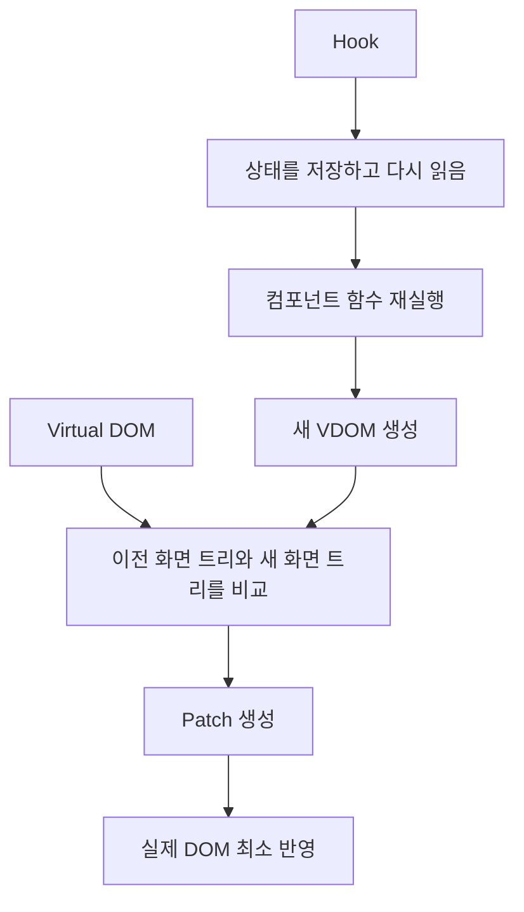
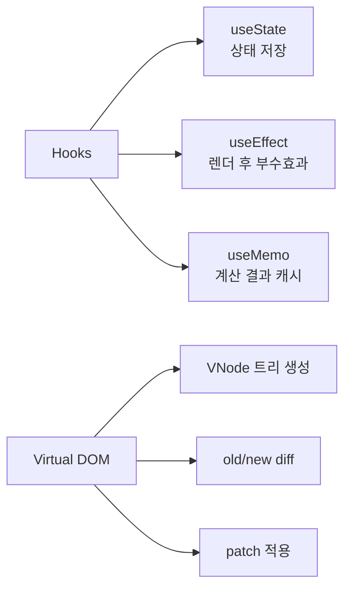
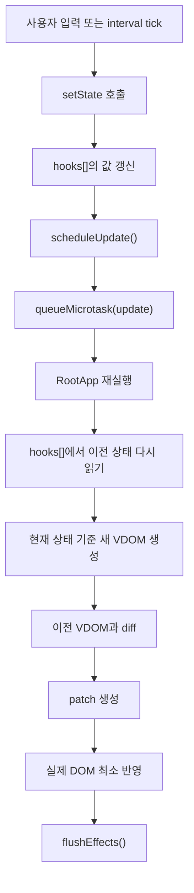
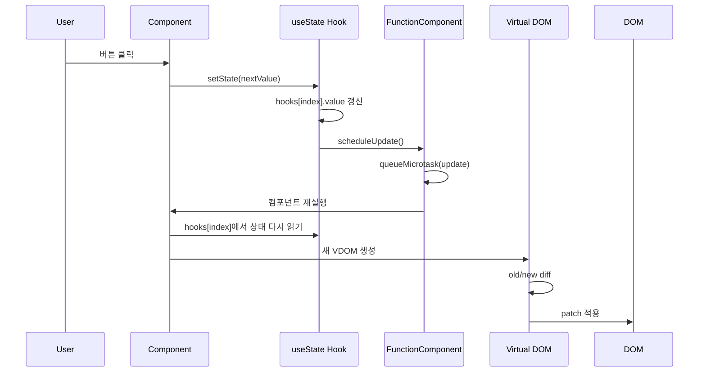
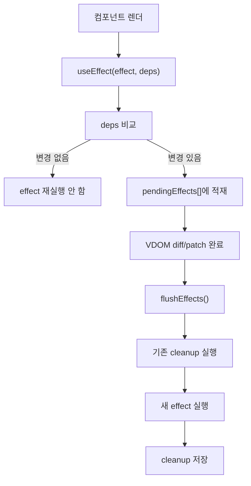
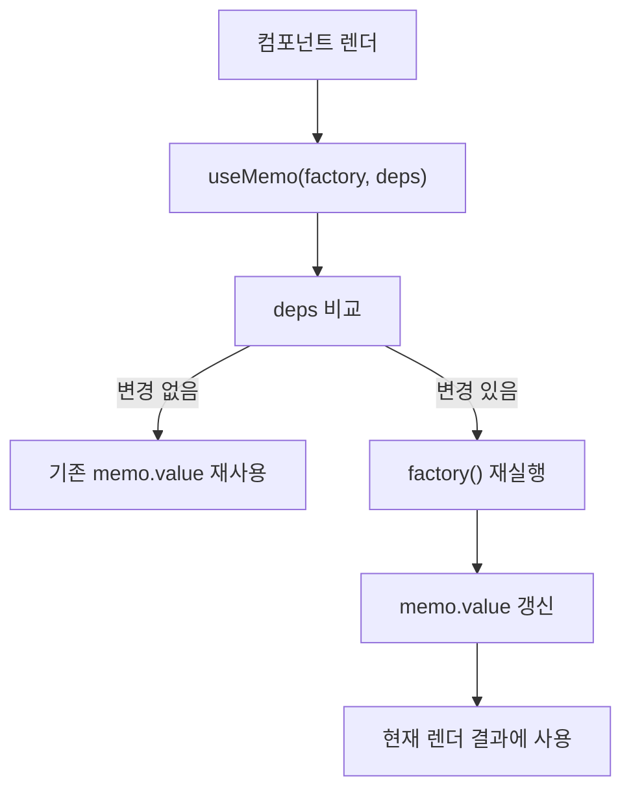
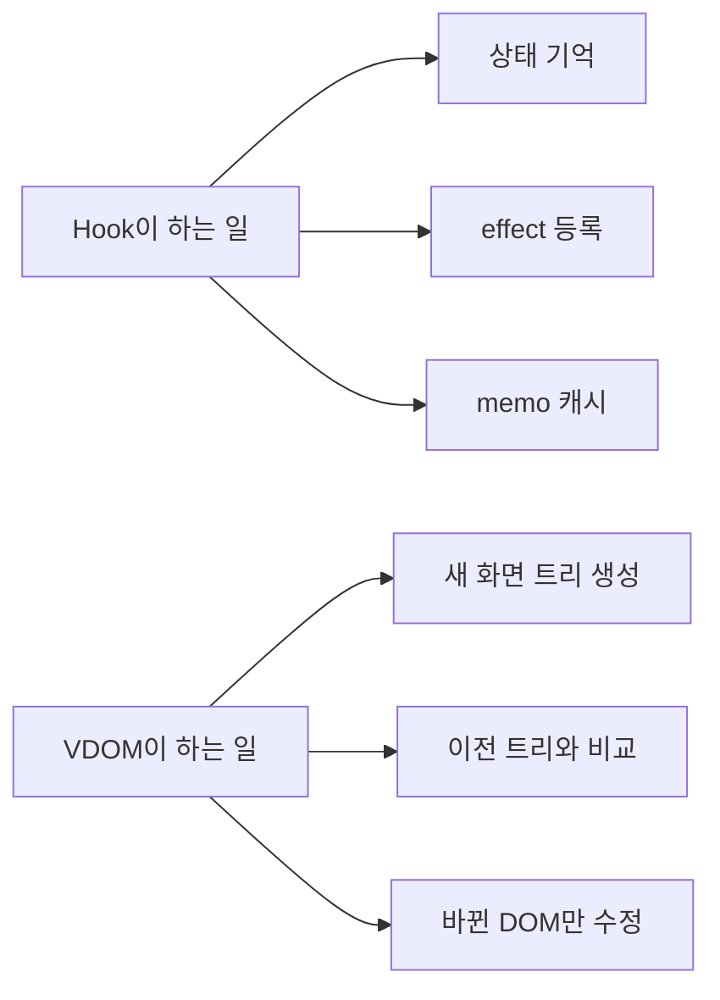
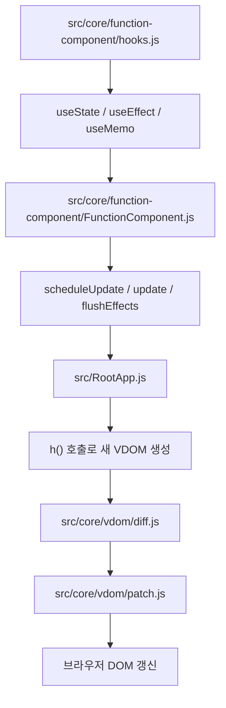

# Hooks · Virtual DOM 연결 흐름도

이 문서는 `훅이 뭔지`, `훅이 Virtual DOM과 어떤 관계로 동작하는지`,  
그리고 `상태 변경이 실제 화면 변경으로 이어지는 전체 흐름`을 시각화해서 설명하는 문서입니다.

핵심은 이 문장입니다.

> **훅은 상태를 기억하는 장치이고, Virtual DOM은 그 상태 변화가 화면에서 무엇을 바꾸는지 계산하는 장치입니다.**

## 1. 큰 그림

## 2. 역할 분리

### 해설

- 훅은 `값을 기억하는 쪽`입니다.
- VDOM은 `화면 차이를 계산하는 쪽`입니다.
- 둘은 서로 다른 역할이지만, 렌더링 파이프라인 안에서 연결됩니다.

## 3. 전체 연결 흐름

## 4. hooks[] 배열이 필요한 이유

```mermaid
flowchart LR
    A["RootApp 렌더 시작"] --> B["hookIndex = 0"]
    B --> C["useState(running) -> hooks[0]"]
    C --> D["useState(elapsedMs) -> hooks[1]"]
    D --> E["useState(startedAtMs) -> hooks[2]"]
    E --> F["useState(laps) -> hooks[3]"]
    F --> G["useEffect(interval) -> hooks[4]"]
    G --> H["useMemo(summary) -> hooks[5]"]
    H --> I["useEffect(title) -> hooks[6]"]
```

### 해설

- 함수형 컴포넌트는 다시 실행될 때 지역변수가 새로 만들어집니다.
- 그래서 상태를 함수 밖 저장소에 따로 두어야 합니다.
- 현재 구현에서는 그 저장소가 `FunctionComponent.hooks[]`입니다.
- 훅은 이름이 아니라 **호출 순서**로 같은 슬롯을 다시 찾습니다.

## 5. useState 단독 흐름

### 핵심

- `useState`는 직접 DOM을 바꾸지 않습니다.
- 상태를 바꾸고, 재렌더를 예약합니다.
- 실제 화면 변경은 재렌더 이후 VDOM diff/patch 단계에서 일어납니다.

## 6. useEffect 흐름

### 이 프로젝트에서의 실제 예

- `interval effect`
  - `running`과 `startedAtMs`가 바뀌면 새 interval 등록
  - 이전 interval은 cleanup에서 `clearInterval`
- `title effect`
  - `running`, `elapsedMs`가 바뀌면 `document.title` 갱신

## 7. useMemo 흐름

### 이 프로젝트에서의 실제 예

- `laps`가 바뀔 때만
  - 최신 랩 시간
  - fastest lap
  - slowest lap
를 다시 계산합니다.

## 8. Hook과 VDOM의 경계

### 해설

- Hook은 상태 저장소에 가깝습니다.
- VDOM은 렌더 결과 비교기에 가깝습니다.
- 훅이 직접 DOM을 수정하지는 않습니다.
- VDOM이 상태를 저장하지도 않습니다.

## 9. 이 프로젝트 코드에 대응시키면

## 10. 발표용 한 줄 설명

> 훅은 함수형 컴포넌트가 다시 실행돼도 이전 상태를 유지하게 해 주는 저장 규칙이고, Virtual DOM은 그 상태로 다시 만든 화면 트리를 이전 트리와 비교해 바뀐 부분만 실제 DOM에 반영하는 역할입니다.
