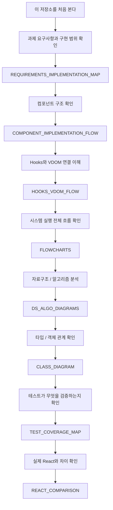
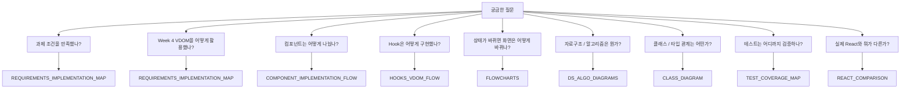
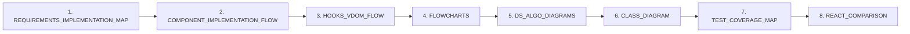
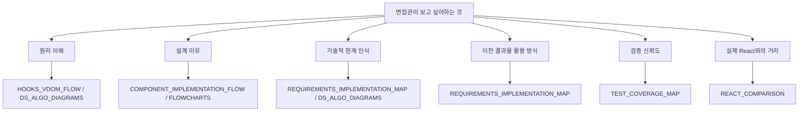

# 마스터 다이어그램 아틀라스

이 문서는 면접관이나 리뷰어가 저장소의 다이어그램만 보고도  
`무엇을 먼저 봐야 하는지`, `어떤 질문에 어떤 문서를 보면 되는지`를 바로 알 수 있게 만든 안내 문서입니다.

## 1. 전체 지도

## 2. 질문별 문서 매핑

## 3. 문서별 역할

| 문서 | 역할 | 면접 질문 예시 |
| --- | --- | --- |
| `REQUIREMENTS_IMPLEMENTATION_MAP` | 과제 요구사항 대응, Week 4 VDOM 활용 방식 설명 | "이 과제 요구사항을 어떻게 충족했나요?" |
| `COMPONENT_IMPLEMENTATION_FLOW` | FunctionComponent, RootApp, StopwatchCard 구조 설명 | "왜 이런 컴포넌트 구조로 나눴나요?" |
| `HOOKS_VDOM_FLOW` | useState/useEffect/useMemo와 VDOM 연결 설명 | "Hook이 정확히 뭐고 VDOM과 어떤 관계인가요?" |
| `FLOWCHARTS` | 시스템 전체 실행 흐름과 파일 구성 | "사용자 입력부터 DOM 반영까지 설명해보세요." |
| `DS_ALGO_DIAGRAMS` | 자료구조, 알고리즘, 복잡도 설명 | "이 구현의 자료구조와 알고리즘은 무엇인가요?" |
| `CLASS_DIAGRAM` | 런타임 객체, VNode, Patch, Hook 구조 설명 | "내부 객체 구조를 한눈에 설명해보세요." |
| `TEST_COVERAGE_MAP` | 테스트 구조와 검증 범위 설명 | "테스트는 무엇을 검증하나요?" |
| `REACT_COMPARISON` | 실제 React와의 차이 설명 | "실제 React와 가장 큰 차이는 무엇인가요?" |

## 4. 추천 보는 순서

## 5. 면접관 관점 핵심 포인트

## 6. 한 줄 요약

> 이 저장소의 다이어그램은 `요구사항 -> 컴포넌트 구조 -> Hooks/VDOM 연결 -> 시스템 흐름 -> 자료구조/알고리즘 -> 클래스/타입 관계 -> 테스트 범위 -> 실제 React와의 차이` 순서로 읽으면 전체 구현을 거의 빠짐없이 이해할 수 있게 설계되어 있습니다.
