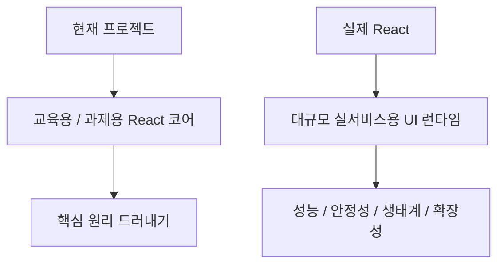
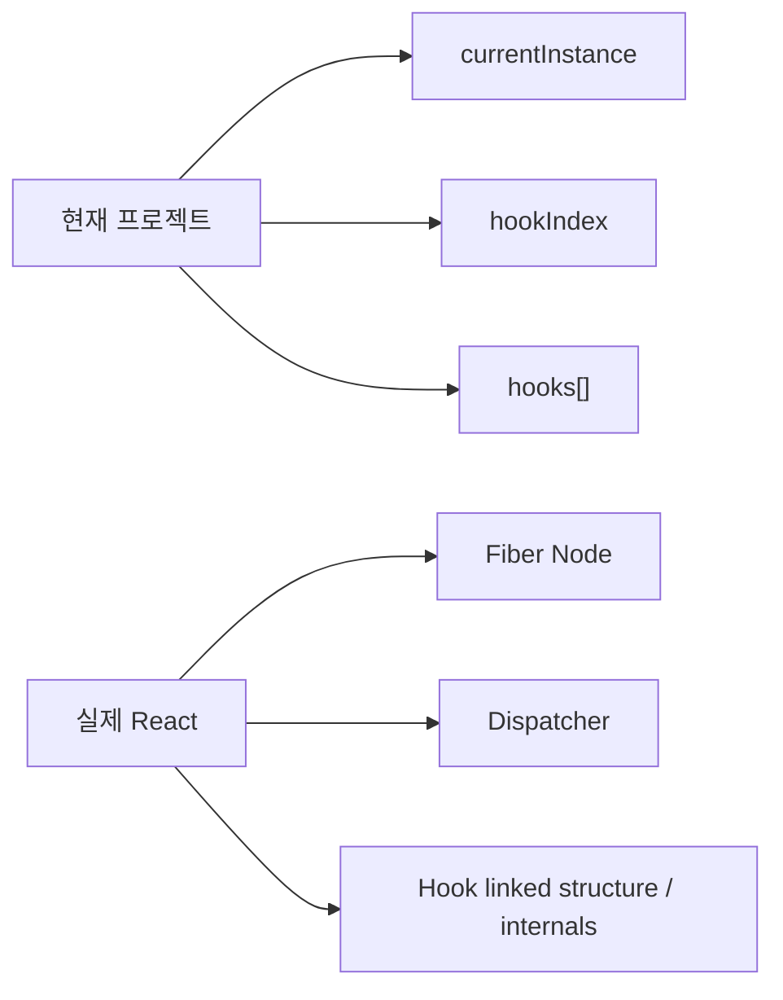
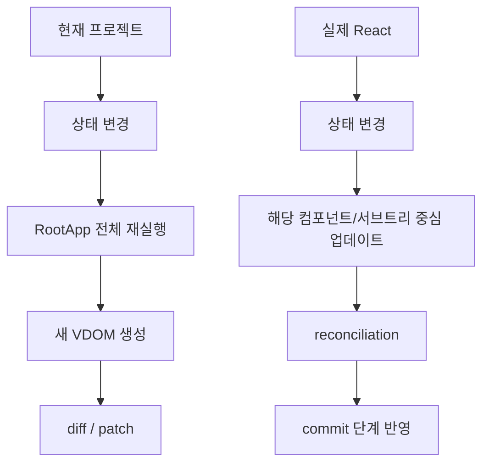
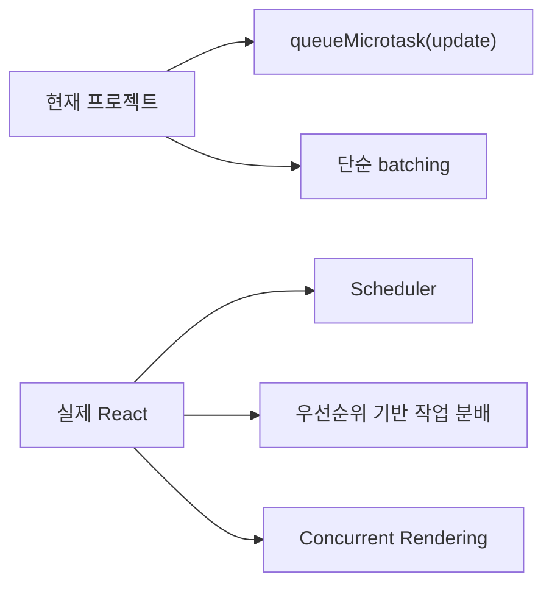
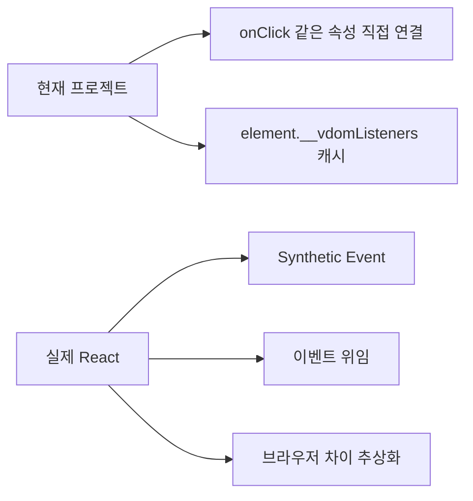
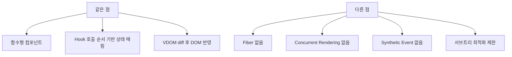
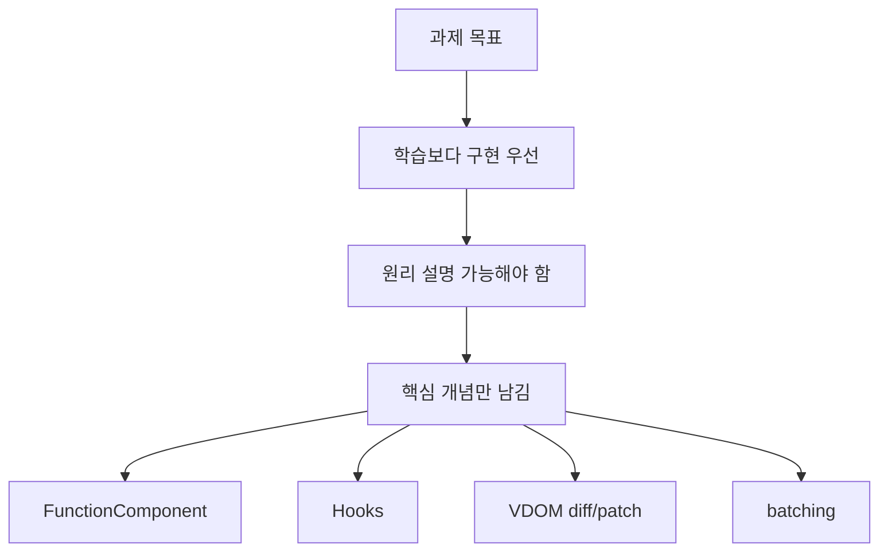

# 실제 React와의 차이점 비교표

이 문서는 현재 프로젝트의 커스텀 React 코어와 실제 React를 비교해서,  
어디까지는 비슷하고 어디부터는 의도적으로 단순화했는지 설명하는 문서입니다.

## 1. 한눈에 보는 비교

## 2. 비교표

| 주제 | 현재 프로젝트 | 실제 React |
| --- | --- | --- |
| 목적 | React 핵심 원리 구현과 설명 | 대규모 UI 애플리케이션 운영 |
| 컴포넌트 구조 | 루트 중심 함수형 컴포넌트 | 컴포넌트별 독립 실행 단위 |
| 상태 저장 | `hooks[]` 배열 + 호출 순서 | Fiber + Hook dispatcher |
| 렌더링 단위 | 루트 `RootApp()` 전체 재실행 | 서브트리 단위 업데이트 최적화 |
| 스케줄링 | `queueMicrotask` 기반 단순 batching | 우선순위, concurrent rendering, scheduler |
| diff 전략 | 실용적인 heuristic diff | 더 정교한 reconciliation |
| 이벤트 시스템 | 직접 DOM 이벤트 연결 | Synthetic event 시스템 |
| 최적화 | `useMemo`, batching 정도 | `memo`, lazy, suspense, concurrent features |
| 테스트 범위 | 교육용 엔진과 시연 앱 중심 | 광범위한 브라우저/플랫폼/생태계 지원 |

## 3. Hook 구현 비교

### 해설

- 현재 구현은 `currentInstance + hookIndex + hooks[]` 조합으로 훅을 동작시킵니다.
- 실제 React는 각 컴포넌트에 대응되는 Fiber 내부 구조와 dispatcher 메커니즘을 통해 훅을 배정합니다.
- 즉 원리는 비슷하지만, 실제 React는 훨씬 더 복잡하고 정교합니다.

## 4. 렌더링 비교

### 해설

- 현재 구조에서는 상태 하나만 바뀌어도 `RootApp()` 전체가 다시 실행됩니다.
- 실제 React는 필요한 서브트리 중심으로 더 세밀하게 작업을 나눕니다.

## 5. 스케줄링 비교

### 해설

- 현재 프로젝트는 `같은 동기 구간의 setState를 한 번에 묶는다` 수준의 batching입니다.
- 실제 React는 어떤 업데이트를 먼저 처리할지, 중간에 양보할지까지 고려합니다.

## 6. 이벤트 비교

## 7. 무엇이 같고 무엇이 다른가

## 8. 왜 이렇게 단순화했는가

### 해설

- 이번 프로젝트의 목표는 실제 React를 완전히 복제하는 것이 아닙니다.
- React가 왜 그런 구조를 가지는지 보여 주는 최소 엔진을 만드는 쪽에 집중했습니다.

## 9. 면접에서 이렇게 말하면 좋음

> 실제 React와 가장 큰 차이는 실행 단위와 스케줄링입니다. 현재 구현은 루트 중심 교육용 엔진이라 상태 하나만 바뀌어도 루트 전체가 다시 실행되지만, 실제 React는 Fiber 기반으로 컴포넌트별 작업을 더 세밀하게 나누고 우선순위까지 관리합니다.

## 10. 한 줄 요약

> 현재 프로젝트는 실제 React의 모든 기능을 재현한 것이 아니라, 함수형 컴포넌트, Hooks, Virtual DOM diff/patch, batching이라는 핵심 원리를 설명 가능하게 압축한 교육용 React 코어 구현입니다.
