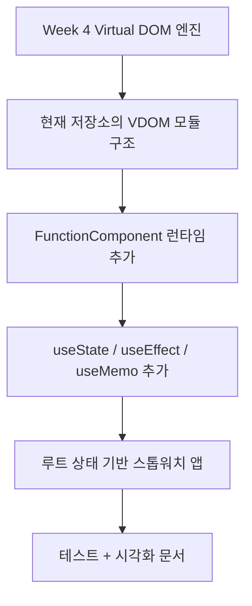
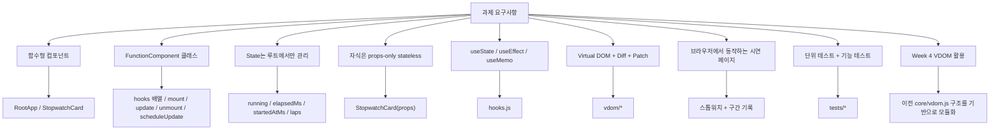
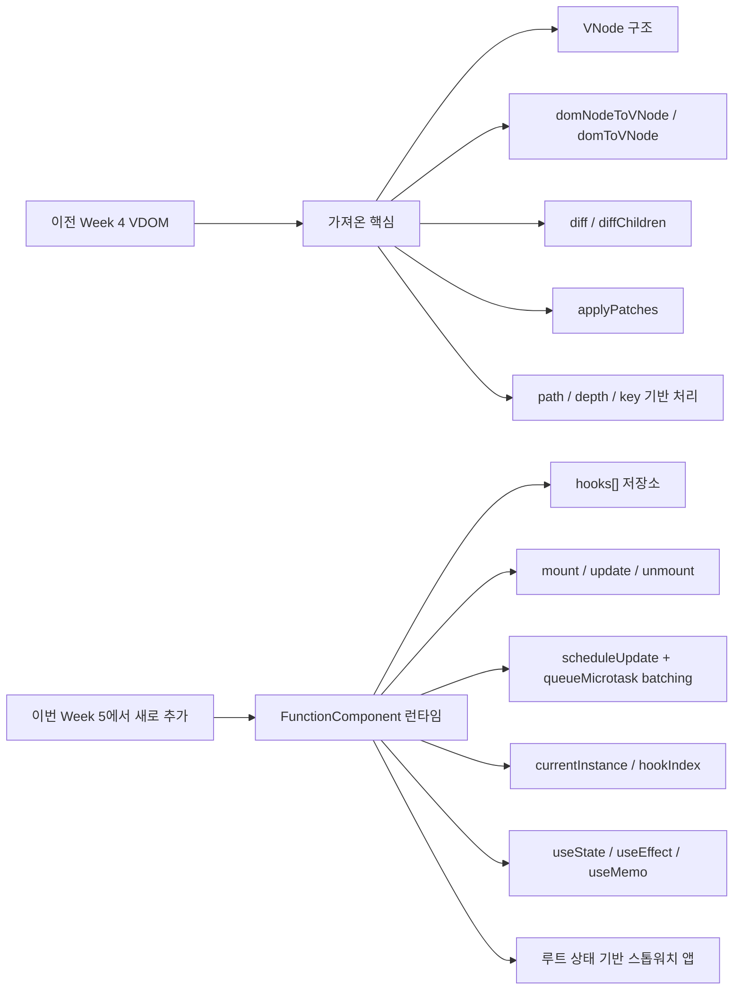
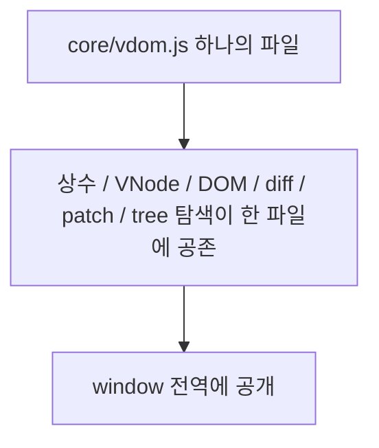
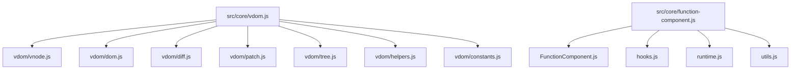
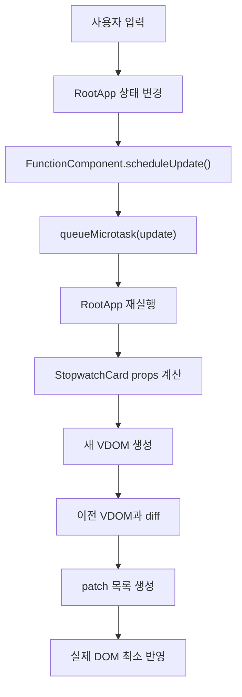
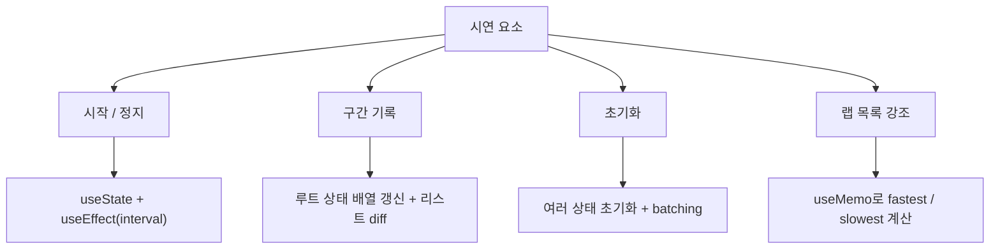

# 과제 요구사항 · 구현 매핑 문서

이 문서는 수요 코딩회 과제 요구사항을 기준으로,  
현재 저장소가 **무엇을 구현했고**, **어떻게 구현했고**, **Week 4 Virtual DOM을 어떻게 가져와 확장했는지**를 한눈에 볼 수 있게 정리한 문서입니다.

## 1. 한 장 요약

## 2. 과제 요구사항 체크맵

## 3. 요구사항별 구현 위치

| 요구사항 | 현재 구현 | 위치 |
| --- | --- | --- |
| 함수형 컴포넌트 | `RootApp`, `StopwatchCard`를 함수형으로 구현 | `src/RootApp.js`, `src/components/StopwatchCard.js` |
| `FunctionComponent` 클래스 | `hooks[]`, `mount()`, `update()`, `scheduleUpdate()`, `unmount()` 제공 | `src/core/function-component/FunctionComponent.js` |
| 루트 상태 관리 | 상태를 `RootApp`에만 둠 | `src/RootApp.js` |
| stateless 자식 | 자식은 props만 받아 렌더 | `src/components/StopwatchCard.js` |
| `useState` | 상태 저장 및 갱신 | `src/core/function-component/hooks.js` |
| `useEffect` | interval 등록 / cleanup, title 갱신 | `src/core/function-component/hooks.js`, `src/RootApp.js` |
| `useMemo` | 랩 요약값 계산 | `src/core/function-component/hooks.js`, `src/RootApp.js` |
| Virtual DOM 생성 | `h`, `createElementVNode`, `createTextVNode` | `src/core/vdom/vnode.js` |
| Diff | `diff`, `diffChildren` | `src/core/vdom/diff.js` |
| Patch | `applyPatches` | `src/core/vdom/patch.js` |
| 브라우저 시연 | 스톱워치 + 구간 기록 | `src/app.js`, `src/RootApp.js` |
| 단위 테스트 | hooks, diff/patch | `tests/function-component.test.js`, `tests/vdom.test.js` |
| 기능 테스트 | 실제 클릭/타이머 흐름 | `tests/app.test.js` |

## 4. "Week 4 VDOM을 가져와 확장했다"는 말의 정확한 의미

이 부분은 발표에서 가장 정확하게 말해야 하는 부분입니다.

### 결론

> **이전 프로젝트의 VDOM 핵심 구조를 기반으로 현재 저장소의 VDOM 모듈을 재구성했고, 그 위에 FunctionComponent와 Hooks 런타임을 새로 얹어 React 형태로 확장했습니다.**

즉,

- **그대로 복붙만 한 것은 아님**
- **아예 새로 만든 것도 아님**
- **이전 VDOM 코어의 구조와 알고리즘을 가져와 현재 구조에 맞게 모듈화하고 확장한 것**

입니다.

## 5. 이전 프로젝트에서 가져온 것과 새로 추가한 것

## 6. 구조 관점에서의 변환

### 이전 프로젝트

### 현재 프로젝트

### 의미

- 이전에는 VDOM 코어가 한 파일에 모여 있었습니다.
- 현재는 그 구조를 기능별 모듈로 분리했습니다.
- 그리고 VDOM 엔진 옆에 `FunctionComponent` 런타임 계층을 새로 추가했습니다.

## 7. 실제 구현 흐름

## 8. 발표에서 이렇게 말하면 안전함

### 추천 표현

> Week 4에서 만든 Virtual DOM 엔진의 핵심 구조와 diff/patch 흐름을 기반으로 현재 저장소의 VDOM 모듈을 재구성했습니다. 그리고 이번 과제에서는 그 위에 `FunctionComponent`, `useState`, `useEffect`, `useMemo`, microtask batching을 추가해 React 형태의 런타임으로 확장했습니다.

### 피하면 좋은 표현

- "전부 새로 만들었다"
- "그냥 그대로 복사했다"

둘 다 부정확합니다.

## 9. 시연 앱이 과제 요구사항을 어떻게 보여 주는가

### 해설

- `시작 / 정지`는 `useState`와 `useEffect`를 보여 줍니다.
- `구간 기록`은 배열 상태 변경과 리스트 렌더링을 보여 줍니다.
- `초기화`는 여러 상태를 한 번에 바꾸는 흐름과 batching을 보여 줍니다.
- `랩 강조`는 `useMemo` 기반 파생값 계산을 보여 줍니다.

## 10. 남는 한계도 같이 말해야 함

현재 구조는 과제 요구사항에는 적합하지만, 실제 React와는 차이가 있습니다.

- 상태 하나만 바뀌어도 `RootApp()` 전체가 다시 실행됩니다.
- 모든 컴포넌트가 독립적인 Fiber를 가지지는 않습니다.
- diff는 실용적인 heuristic 비교이고, 항상 최소 편집 비용을 찾는 것은 아닙니다.
- `StopwatchCard`는 stateless로 설계해 과제 제약을 맞춘 구조입니다.

## 11. 최종 한 줄 요약

> 이 프로젝트는 **Week 4 Virtual DOM 코어를 기반으로 현재 저장소의 VDOM 엔진을 모듈화하고, 그 위에 FunctionComponent와 Hooks 런타임을 추가해 스톱워치 시연 앱으로 확장한 커스텀 React 코어 구현**입니다.
