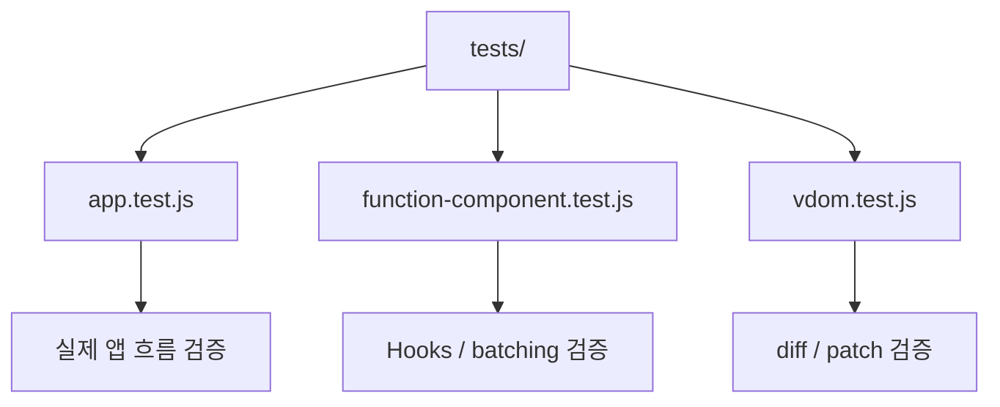
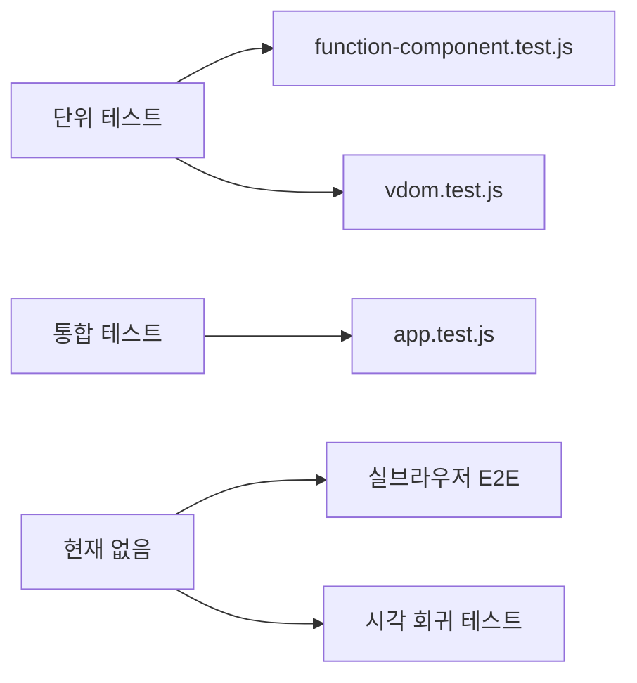
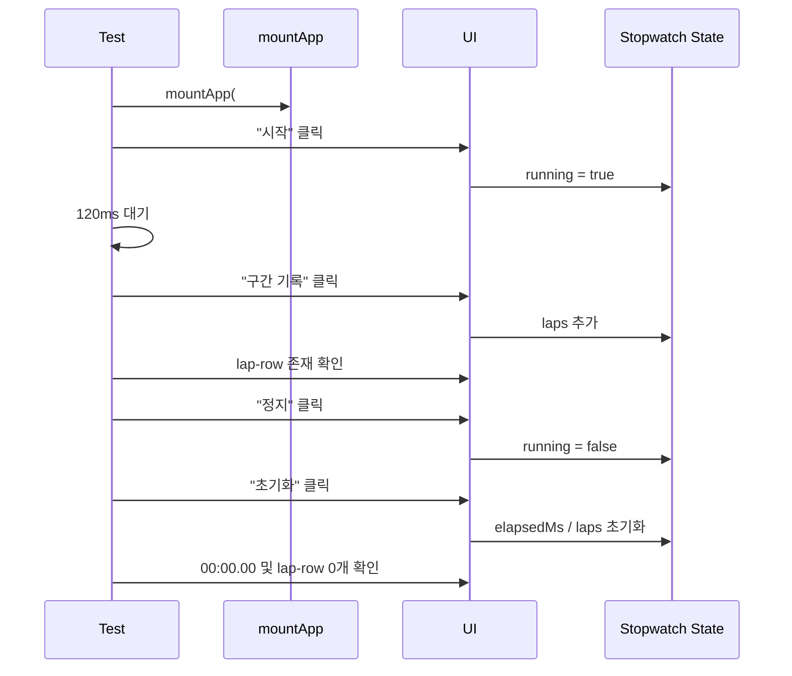
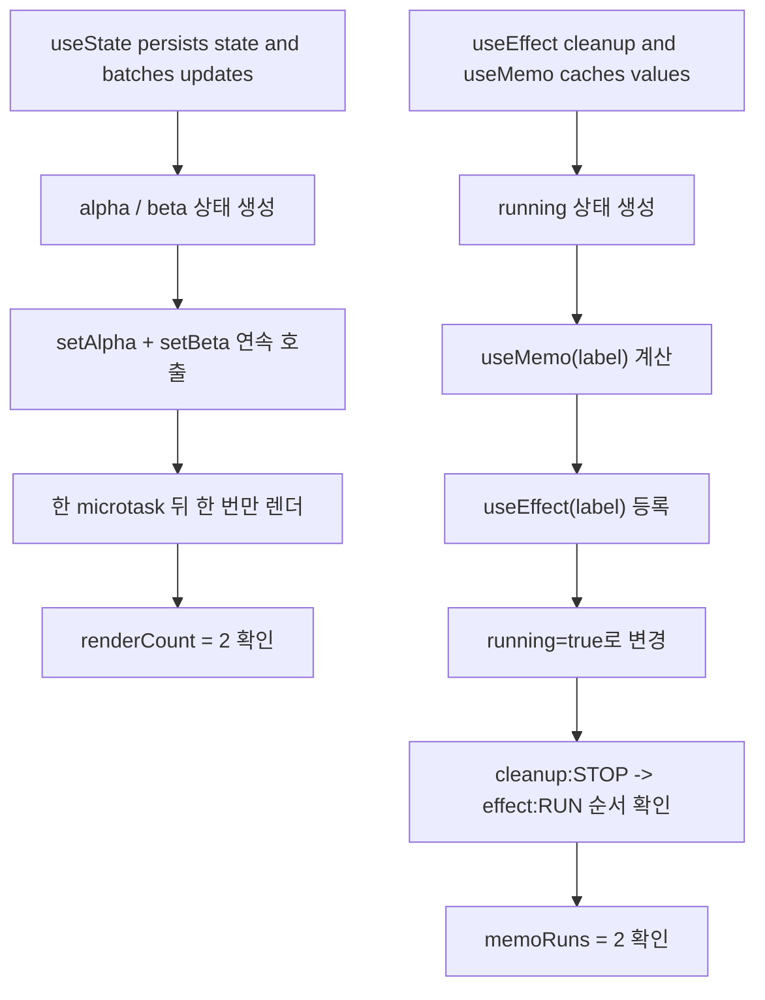
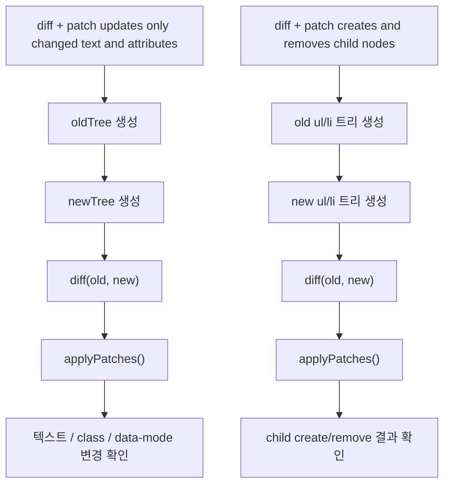
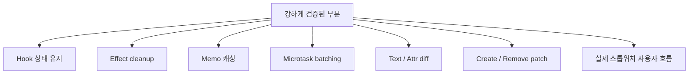
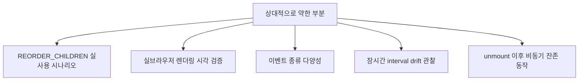

# 테스트 커버리지 지도

이 문서는 현재 테스트가 **어느 모듈을 검증하는지**,  
**무엇이 이미 검증되었고 무엇은 아직 상대적으로 약한지**를 시각적으로 설명하는 문서입니다.

## 1. 테스트 전체 지도

## 2. 테스트와 모듈 매핑

```mermaid
flowchart TD
    A["app.test.js"] --> A1["src/app.js"]
    A --> A2["src/RootApp.js"]
    A --> A3["src/components/StopwatchCard.js"]
    A --> A4["src/utils/formatStopwatch.js"]

    B["function-component.test.js"] --> B1["src/core/function-component/FunctionComponent.js"]
    B --> B2["src/core/function-component/hooks.js"]
    B --> B3["src/core/function-component/runtime.js"]
    B --> B4["src/core/function-component/utils.js"]

    C["vdom.test.js"] --> C1["src/core/vdom/vnode.js"]
    C --> C2["src/core/vdom/diff.js"]
    C --> C3["src/core/vdom/patch.js"]
    C --> C4["src/core/vdom/dom.js"]
```

## 3. 테스트 레벨 분류

## 4. app.test.js가 검증하는 흐름

### 검증 포인트

- mount가 정상 동작하는지
- 시작 버튼으로 타이머 effect가 실제 동작하는지
- 구간 기록으로 리스트 렌더링이 생기는지
- 정지/초기화가 상태를 되돌리는지

## 5. function-component.test.js가 검증하는 흐름

### 검증 포인트

- `useState`가 재렌더 후에도 상태를 유지하는지
- batching이 실제로 한 번의 update로 묶이는지
- `useEffect` cleanup이 deps 변경 시 실행되는지
- `useMemo`가 deps가 바뀔 때만 재계산되는지

## 6. vdom.test.js가 검증하는 흐름

### 검증 포인트

- 텍스트 patch
- 속성 set/remove patch
- 자식 생성 / 삭제 patch
- 전체를 갈아엎지 않고 원하는 DOM 결과가 되는지

## 7. 커버리지 관점에서 강한 부분

## 8. 상대적으로 약한 부분

### 해설

- reorder 로직은 구현돼 있지만 현재 앱 시나리오가 고정 구조라 강하게 검증되진 않습니다.
- 테스트는 JSDOM 기반이라 브라우저 렌더링 차이까지 보장하진 않습니다.
- 현재는 과제용 기준에서 충분하지만, 포트폴리오 관점에선 E2E나 시각 검증이 있으면 더 강해집니다.

## 9. 면접관에게 이렇게 설명하면 좋음

> 테스트는 세 층으로 나뉩니다. 앱 통합 테스트는 실제 사용자 흐름을 검증하고, function-component 테스트는 hooks와 batching 같은 런타임 원리를 검증하며, vdom 테스트는 diff/patch 엔진 자체를 검증합니다.

## 10. 한 줄 요약

> 현재 테스트는 `앱 흐름`, `Hooks 런타임`, `VDOM diff/patch`를 각각 분리해서 검증하고 있으며, 과제 요구사항 기준 핵심 동작은 대부분 커버하고 있습니다.
